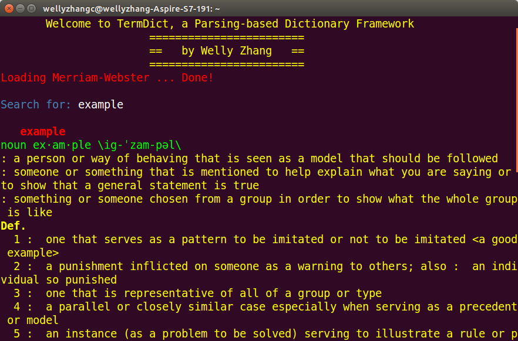

# TermDict -- A Framework for Parsing-based Terminal Dictionary

# Introduction
*TermDict* is a framework for dictionaries on Console, based on web parsing technology. The motivation arises from my personal experience in looking up words in web dictionaries such as [Merriam-Webster](http://www.merriam-webster.com/) and [iCIBA](http://www.iciba.com/): either Chrome takes up too much of my limited memory or the web is filled with annoying advertisements, distracting me from reading on. And there came the idea of **Terminal Dictionary**. APIs were the first to pop up in my mind, but APIs turned out to be constrained in terms of the maximum daily references and the number of dictionaries available, which eventually gave birth to my **Parsing-based Terminal Dictionary**.

# Dependency

* BeautifulSoup
* requests

# Usage

To install the package, type

```python
python setup.py install
```

Upon installation, you could load your dictionary(s) from the command line by providing dictionary codes as parameters to the command, such as

```bash
td mw youdao
```

Then feel free to look up the words!



# Extension

To add support for other web dictionaries,

1. Create a new dictionary class that inherits from BaseDict.
2. Implement your own methods of ```parse_web``` and ```pprint```.
3. Write the dictionary loading code in main.py. 

# References

\[1\] Flowerowl. [ici](https://github.com/Flowerowl/ici)

\[2\] longcw. [youdao](https://github.com/longcw/youdao)

